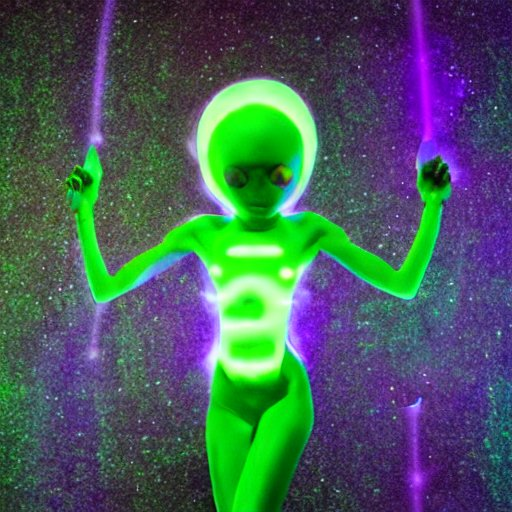
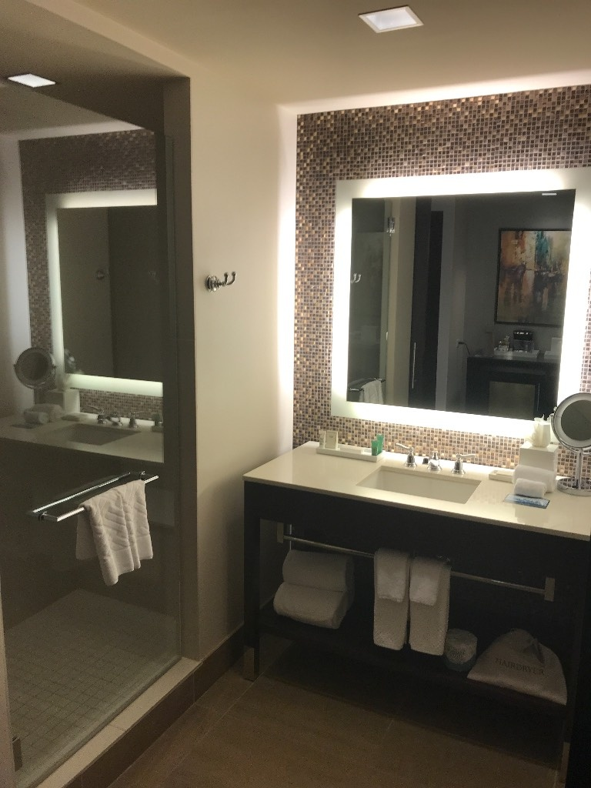
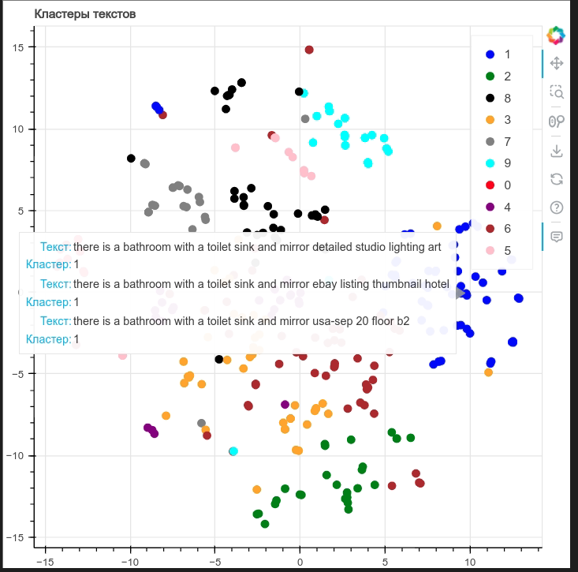
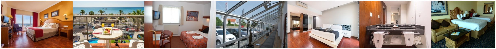
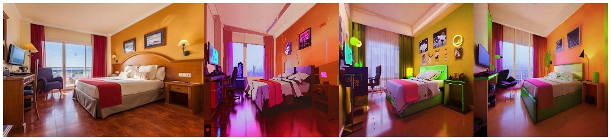
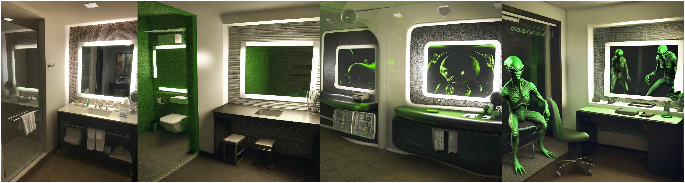
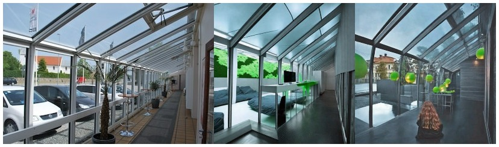
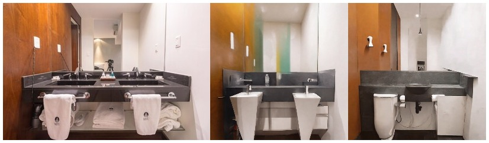

# Кодовая база для выполнения задания:
- https://colab.research.google.com/drive/1X4axiBLyMqIvkbNMnn9tsRpigY3qet1a?usp=sharing - colab-ноутбук с анализом датасета и отбором тренировочной части

- https://github.com/Petilia/clip_interrogator_inference - репозиторий с инференсом CLIP Interrogator и построением кластеризации, а также docker-образом для работы

# Образ и предпочтения инопланетян

## Внешность инопланетян

Инопланетяне могут иметь разнообразные формы тела, цвета кожи и свечения. Они часто обладают несколькими глазами или антеннами. 

Типичный инопланетянин представлен выше (типичный для Stable Diffusion v1.5)

## Предпочтения при выборе отеля

- **Цвета**: Инопланетянам нравится неоновое свечение, а также зеленые цвета.

- **Безопасность и спокойствие**: Для инопланетян важна безопасность и спокойствие, поэтому они выбирают места, где нет земных опасностей. Особенно инопланетяне не любят полотенца, поскольку их вид вызывает странное беспокойство.

## Изучение датасета

**Что такое image captioning?**

Image captioning - это задача генерации текстового описания для изображения. В данной задаче нейросетевая модель принимает на вход изображение и генерирует текстовое описание, которое наилучшим образом описывает содержание изображения. Это сочетание областей компьютерного зрения и естественного языка, что делает задачу сложной и интересной.

**Почему над этим работают?**

Работа над image captioning имеет ряд практических применений. Например, она может использоваться для автоматического добавления описаний к фотографиям в социальных сетях, улучшения доступности для людей с нарушениями зрения, создания систем навигации для роботов и многих других приложений.

**Как формулируется задача?**

Задача image captioning формулируется как генерация текстовой последовательности (описания) на основе входного изображения. Основные шаги задачи:

Модель получает на вход изображение (например, в виде вектора признаков, извлеченных из некоторого image encoder-а).
Модель генерирует текстовую последовательность, начиная с токена начала последовательности (например, "start").
На каждом шаге модель предсказывает следующий токен, исходя из предыдущих токенов и входного изображения.
Процесс генерации продолжается до тех пор, пока модель не сгенерирует токен конца последовательности (например, "end") или достигнет максимальной длины описания.

# Аннотация датасета и ответы на вопросы:

## Изучение датасета

Colab с анализом датасета:
https://colab.research.google.com/drive/1X4axiBLyMqIvkbNMnn9tsRpigY3qet1a?usp=sharing

**Что представлено на изображениях?**

Датасет Hotels-50K на Kaggle представляет собой коллекцию фотографий отелей. Каждая фотография изображает интерьер или экстерьер отеля.

**Сколько объектов в датасете?**

В тренировочной части датасета 1124215 изображений.

**Сколько уникальных классов?**

В датасете Hotels-50K содержится фотографии 50000 отелей.  

**Сбалансирован ли датасет?**

Датасет несбалансирован, что хорошо показано на гистограмме в Colab. Количество изображений варьируется от 0 до 400+.

**Какие параметры у изображений?**

Изображения трехканальныйе и могут быть как вертикальными, так и горизонтальными

**Размер фотографий?**

Размер изображений travel_website порядка 350x235 для вертикальных фотографий и 235x350 для горизонтальных 
При это есть фотографии traffickcam высокого разрешения 2952x5248 и 5334x4008

## Обогащение датасета описаниями

Для создания описаний картинок использовался подход CLIP Interrogator.
Для его инференса был создан docker-образ. Инференс проводился на видеокарте 2080 Ti. Репозиторий с кодом для этого представлен здесь: https://github.com/Petilia/clip_interrogator_inference

Пример изображения и описание для него: 

**"there is a bathroom with a sink, mirror, and shower, photo taken in 2018, brightly lit room, midjourney style, by Judith Brown, skybridge towers, various angles, description, tvs, contest winner, floating monitors, symmetric pattern, interconnections, # e 5 3 7 1 b, by Briana Mora, floor b2"**

Подход для сбора и обработки датасета аннотаций:

- На этапе анализа было отобрано 10 отелей, для каждого из которых было сохранено по 30-60 изображений (иначе вычисления аннотаций заняли бы слишком много времени). Данные изображения были аннотированы с помощью CLIP Interrogator. 

- Аннотации, полученные с помощью CLIP Interrogator достаточно длинные. Первые слова в них соответствуют картинке, однако дальше модель начинает "галлицинировать". Поэтому аннотация обрезается до первых 14 слов. Аннотации лежат в [./dataset_with_descriptionds.csv](./dataset_with_descriptionds.csv)

- Слова в обрезанных аннотации подвергаются нормализации путем лемматизации.

- Поверх корпуса полученных слов строится TF-IDF

- Поверх TF-IDF строится TrencatedSVD на 50 компонент

- Для визуализации кластеров используется TSNE 

- На полученных признаках строятся модели кластеризации KMeans. Оптимальное число параметров определяется "методом локтя".

На изображении ниже представлены полученные кластеры. Из визуализации очевидно, что кластеризация произошла хорошо, однако точки сгруппировались не по классам отелей. Вместо этого группировка произошла по типам помещений (ванная, спальная и т.д.). Данное явление очевидно, исходя из того, что описание каждой картинки представляет собой совокупность характерных для нее объектов и почти не имеет уникальной информации об отеле, к которому относится. 

# Изменение изображения при помощи диффузионной модели
**Выбор фотографий**

Были выбраны следующие фотографии: 

## Изменение фотографий
Для изменения фотографий использована [StableDiffusionMagic](https://github.com/rupeshs/diffusionmagic?ysclid=llkknjn6pv895581605)

Попробуем немного изменить подсветку комнаты, чтобы инопланетным гостям привычнее смотрелось:

Также добавим более привычную подсветку и в ванную комнату, а также более привычных обитателей.

Немного изменим вид за окном:

Инопланетяне считают, что использовать полотенца небезопасно, поэтому попробуем избавиться от них. Получается неидеально, поскольку полотенца не совсем удаляются, а скорее становится частью интерьера.

## Улучшения
- Контролировать сохранность контента можно регулирая уровень classifier-free guidance (чем меньше, тем больше оригинального контента сохранится)
- Можно обучить стилевой токен на нескольких изображениях, соответствующих запросу инопланетян, а потом добавлять этот токен в промпт. Этот подход называется Textual Inversion (https://huggingface.co/docs/diffusers/training/text_inversion)
- Применить идею из статьи https://arxiv.org/pdf/2210.09276.pdf. В ней сохранность оригинального контента задается параметром alpha (изменяется от 0 до 1, при alpha близким к 0 изображение похоже на оригинальное, при близким к 1 получается почти новое изображение)
- Можно использовать модели для inpainting, вручную закрашивать ненужные объекты, и дорисовывать нужные с помощью этих моделей.